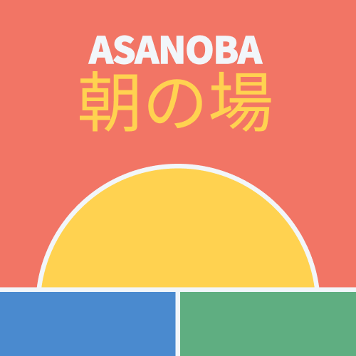

**ASANOBA** (朝の場), meaning *“morning place”* in Japanese, is a collaborative, open-source educational platform designed to support learners of all ages, from early childhood through higher education and lifelong learning. It is a space where curiosity is welcomed, growth is nurtured, and learning is understood as a shared, evolving journey.

The name carries with it a spirit of renewal and calm energy. Just as the morning marks a fresh start in the day, ASANOBA aims to be the beginning of something meaningful, a place where new knowledge, connections, and possibilities emerge.

## 🌱 Philosophy

At its core, ASANOBA believes in the power of **community, modularity, and joyful clarity**. Learning is not a linear experience. It is built from pieces; ideas, questions, experiences; that connect over time. 

ASANOBA is designed to reflect this nature of learning: **fragmented yet fluid, structured yet exploratory**.

## 🧱 Building from the Basics

The brand embraces the metaphor of **building blocks**. Simple elemental forms that, when combined, create something far more powerful than the sum of their parts.

This reflects not only how users interact with the platform (assembling learning journeys, collaborating in shared environments), but also the nature of open-source knowledge itself: distributed, adaptive, and constantly being shaped by those who engage with it.

Design elements across the brand are encouraged to explore this modular concept, with forms that feel **playful, intentional, and expandable**. Like learning itself.

## 🌅 A Sense of Place and New Beginnings

The imagery of a **sunrise** acts as a foundational symbol for the brand. It represents the emotional landscape ASANOBA seeks to create: hopeful, open, and full of potential.

It is not a loud or celebratory energy, but a quiet one. Calm. Focused. Like the early hours of the day when the mind is clear, and everything feels possible.

This symbolism is reflected not just in visuals, but in tone, space, and rhythm across every brand expression.

## 🎨 A Colorful, Human Identity

ASANOBA intentionally embraces a vibrant color palette. It is designed to reflect diversity in age, perspective, and learning style. Bright tones are paired with soft neutrals to balance **energy with spaciousness**, allowing the interface and the brand to feel both lively and accessible.

Each color plays a role in the brand system. Contributing to a feeling of harmony, clarity, and layered meaning. And the expressive use of color mirrors the brand's belief that learning should feel alive, not institutional.

## ✨ Design with Meaning

ASANOBA’s visual identity is not minimal for the sake of trend, nor decorative for the sake of style. It aims to distill complex ideas into poetic forms where every block, line, or space has purpose.

Whether it’s in the layout of a dashboard, the motion of a loading animation, or the construction of the brand mark itself. The design should evoke a sense of **quiet intelligence**: something that makes users feel **invited, not instructed**.

## 🌏 A Global Spirit, Rooted in Intention

While the brand name reflects a Japanese origin, ASANOBA is a global platform. Its identity subtly honors the Japanese principle of Kaizen (改善), while remaining accessible and relevant to a worldwide audience.

The design system is open, modular, and inclusive.

## 🧩 More Than a Logo

ASANOBA is not defined by a logo alone, but by the **interplay of elements** that shape a coherent experience: vibrant color, basic forms, thoughtful typography, and metaphorical symbolism that mirrors the learning process.

It’s a system built to adapt, evolve, and expand—just like the minds it serves.